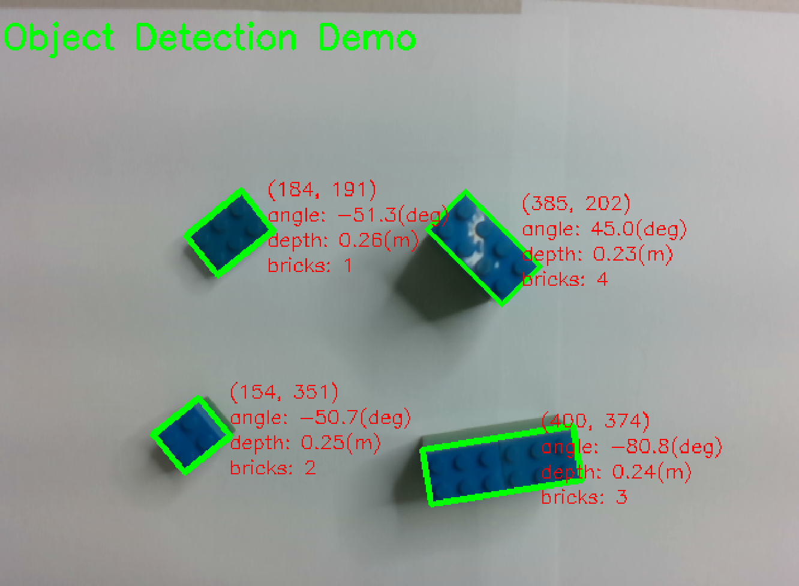
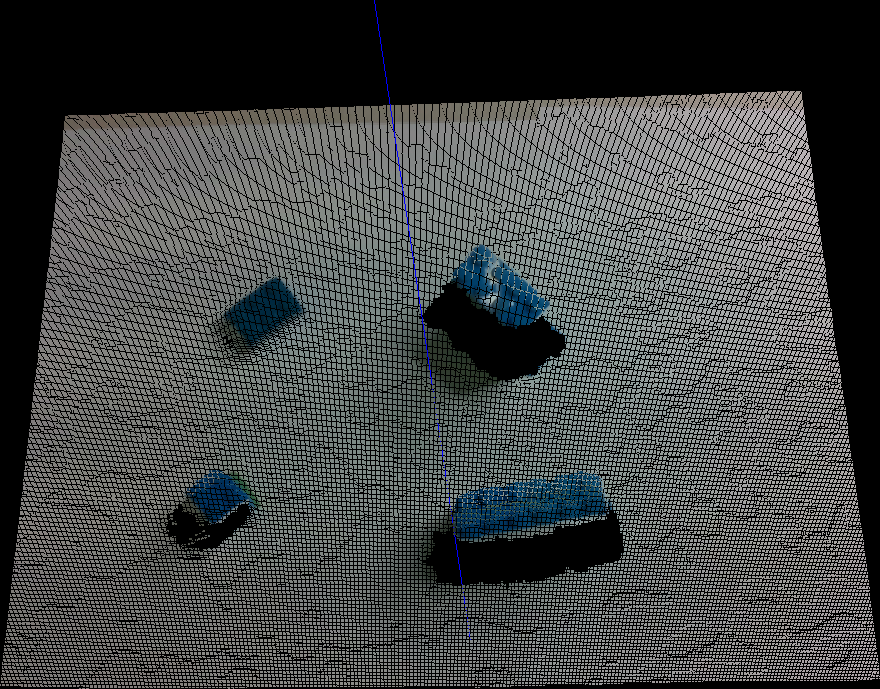
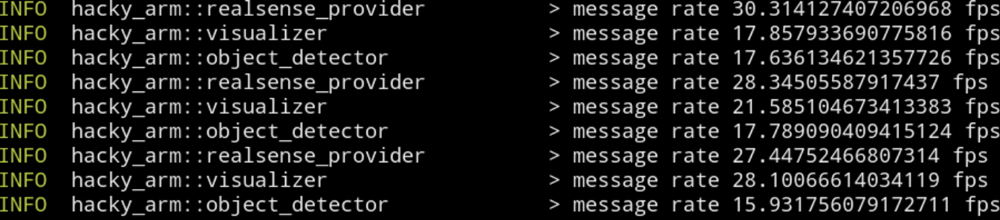

# hacky-arm

> A poor man's robot arm program written in hacky way.

This is a project about designing a robotic arm capable of
grabbing objects wisely by their position and depth.
The object detection is computed via computer vision algorithms,
and the depth of objects is measured by Intel RealSense depth camera.
Furthermore, the framework is implemented in an asynchronous way and written
in a very efficient language Rust.

## Features

| Object Detection |  Point Cloud of Depth/Color Image|
| - | - |
|  |  |

**Auto Grabbing**

<p align="center">
    
</p>

**High Performance**

We achieved a fast frame rate by the asynchronous framework implemented by Rust.
The robotic arm can work with real-time detection.



## Hardware

Robotic arm: Dobot magician<br>
Controller: Nvidia Jetson Nano<br>
Sensor: Intel RealSense D435

## Usage

* Install the Rust toolchain manager, Rustup
    https://www.rust-lang.org/tools/install

* Install the nightly Rust
    ```bash
    rustup toolchain install nightly
    ```

* Install the following dependent libraries on your OS.
    * OpenCV 4.2
    * [librealsense](https://github.com/IntelRealSense/librealsense), please build it with Python binding support.

* Build & execute
    ```bash
    cd arm
    cargo build --release
    ./target/release/hacky-arm
    ```

* Directly run
    ```bash
    cd arm
    cargo run --release
    ```

## Documentation

* User manual: \[[English](https://jerry73204.github.io/hacky-arm/manual.html)\], \[中文\](TBA)
* Calibration: \[[English](https://jerry73204.github.io/hacky-arm/calibration.html)\], \[中文\](TBA)


## Todos

Import RabbitMQ and ProtocolBuffer.

## License

We will finally license the source code in some way. Before it happens, the code is under proprieraty license. Please ask for author's consent if you would like to copy or distribute this project.
