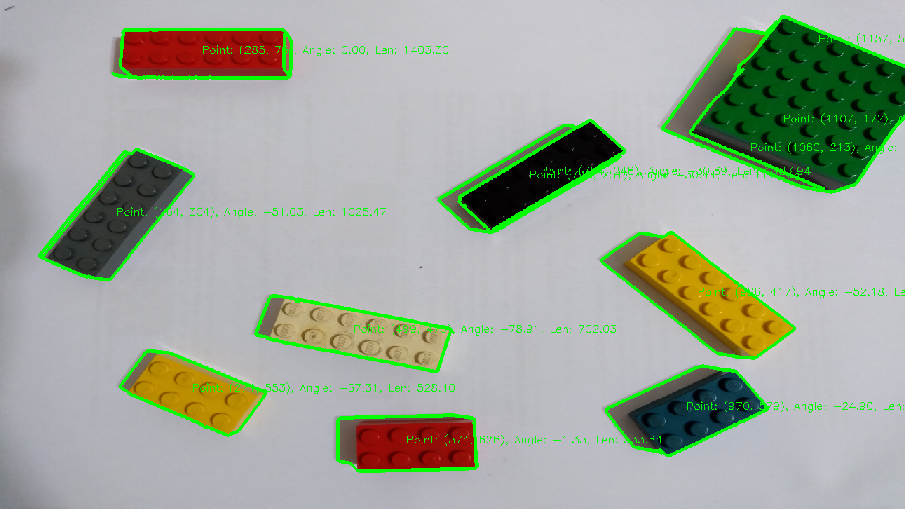
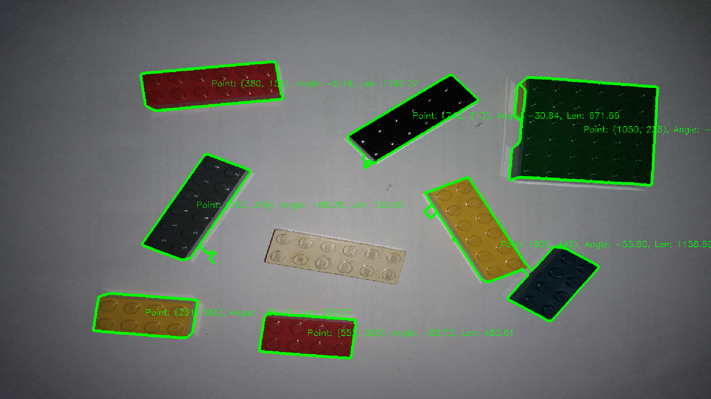

# Detection Sample with opencv-rust


## Change Logs

2020.02.11: Finish v1 demo

## Prerequisites

Build `hacky_arm_common` in _\.\./common_.


_hacky-arm/common_
```bash
cargo build
```


## Samples

```bash
cargo run -- -f ./pic/sample-1.jpg
```



```bash
cargo run -- -f ./pic/sample-2.jpg
```


