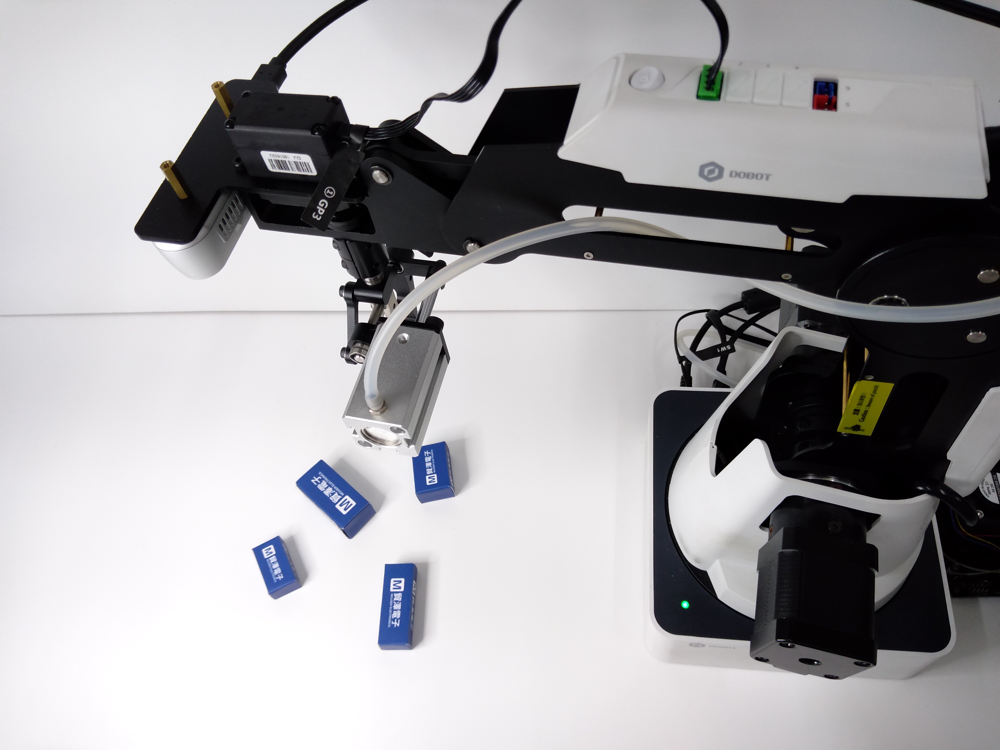
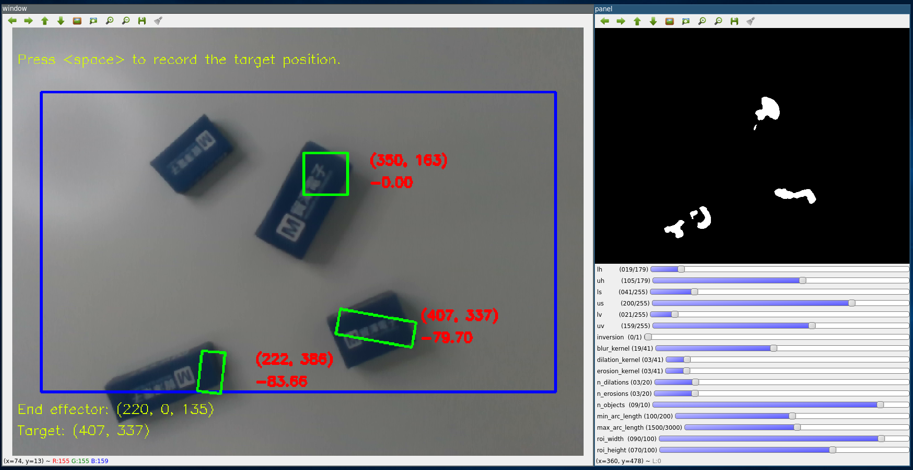
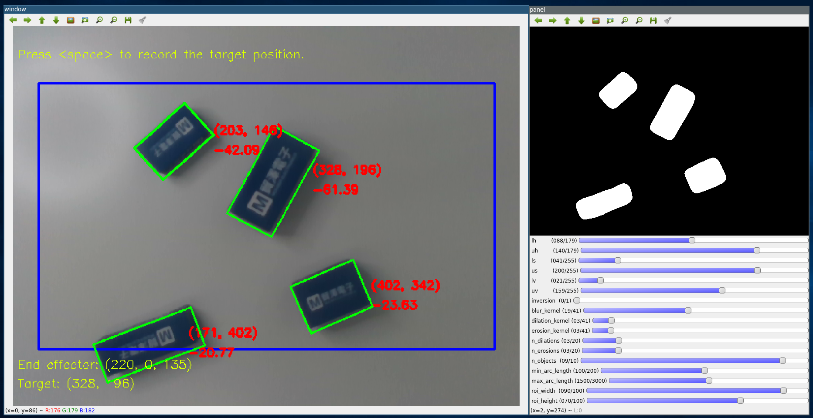
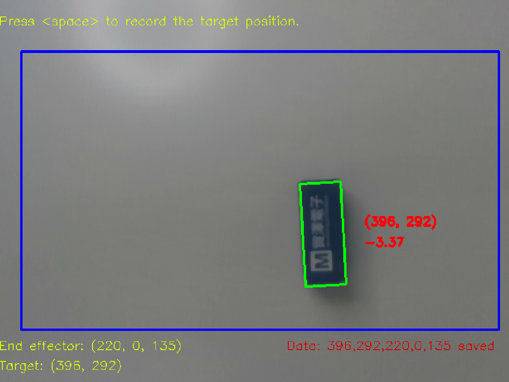
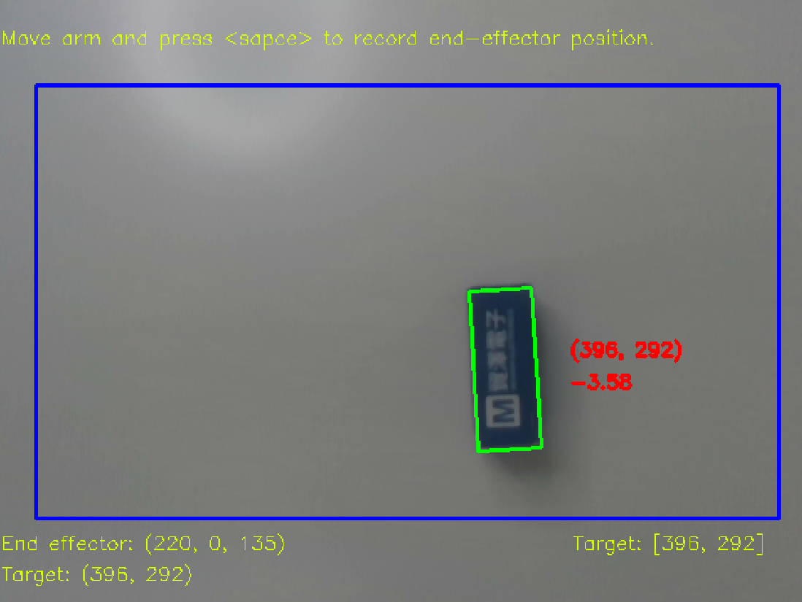

= 機械手臂與感測器的校正
:experimental:
:icons: font

== 校正手臂

假設我們有一些新的物件要去夾取，如下圖。

為了能夠達到更好的辨識結果與更精準的夾取，
我們可以使用輔助程式link:https://github.com/jerry73204/hacky-arm/tree/master/utils/calibrate.py[calibrate.py]
來細調程式的參數。執行程式範例如下。

    ./calibrate.py

接下來，我們將詳細的介紹各種使用情況。

== 調整物件辨識

我們是基於OpenCV函式庫來實做物件辨識的演算法，其中涉及了一些常用的處理如
HSV color thresholding, blurring, dilation/erosion, 等等。

=== 第一步. 事前準備

啟動機械手臂並等待它喚醒，將RealSense深度攝影機和機器人接到控制板上（本專案使用Nvidia Jetson Nano）

接著輸入以下的程式來啟動校正。

    ./calibrate.py

=== 第二步. 重設機器人的座標

我們建議每次重啟手臂時都最好跑一次重新校正，校正其原點位置。使用者可以按下kbd:[r]來去執行重設原點。
請注意到這項動作會花上幾分鐘去完成，請耐心等候。
經過重設後，使用者可以按下kbd:[h]來呼叫機械手臂回到原點。

[NOTE]
為了確保接下來的校正都是正確的，任何時候當攝影機/手臂的位置不小心被改動時請記得讓機械手臂歸位(按下kbd:[h])。

=== 第三步. 調整物件偵測

打開校正程式後，螢幕上會顯示兩個視窗，左邊的視窗會顯示物件偵測的結果，
右邊的視窗則是給使用者微調參數。

程式一開始也許您會發現預設的參數並不那麼適合您欲辨識的物體，例如：

於是乎，我們要做的事情就是調整參數到能夠準確的辨識物體，下表列出各個參數的說明。

.物件辨識參數
[options="header",cols="^3,10"]
|===
| 名稱  ^| 說明
| lh,uh | Hue的上下限
| ls,us | Saturation的上下限
| lv,uv | Value的上下限
| inversion | 交換黑與白的遮罩功用，例如對於那些偏白色的物體，那麼白色的東西就會是我們要辨識的物體。
| {blur,dilation,erosion}_kernel | {中值濾波，膨脹，侵蝕}的核，核的大小越大，所影響的範圍也越大。
| n_{dilations,erosions} | {膨脹，侵蝕}的次數。
| n_objects | 最多允許的辨識物件。
| {min,max}_arc_length | {最長，最短} 允許的物件週長。
| roi_{width,height} | 限制ROI(region of interest)的寬與長，只有在藍色框框的物體才會被視為有效的辨識。
|===

[NOTE]
關於HSV的細節建議，可以參考link:https://www.wikiwand.com/en/HSL_and_HSV[這裡]。

==== 調整物件辨識的一些技巧

因為我們主要是基於顏色的資訊來去辨識物體，其表現效果取決於HSV thresholding的好壞。
舉例來說，如果欲辨識的物體是藍色的，從先備知識中我們可以知道藍色的Hue值應差不多是240度左右，
但是因為OpenCV採用的Hue是從0到179，而不是標準的0~359，所以我們可以猜測我們細調的Hue值應該是120左右。
緊接著，我們可以透過調整`saturation`和`value`的上下限來得到更細緻的辨識結果。
最後，可以試著調整膨脹/侵蝕的次數來使得框出來的矩形更加貼近欲辨識的物體。

這邊我們示範一個適當調整後的結果。

最後記得按下kbd:[s]來儲存這些參數，輸出的檔案預設會存到`hacky-arm/utils/output.json`。

另外，如果想要在下次存取這些參數的話，可以在呼叫校正程式時指定設定檔，如下：

    ./calibrate.py --config output.json

=== 第四步. 更新主程式的參數

請到這個檔案`hacky-arm/arm/config.json`來修改`object_detector`，如下：

[source, json, options="nowrap"]
----
        ⋮
"object_detector": {
    "params_file": "設定檔的位置",
},
        ⋮
----

現在我們可以`hack-arm/arm`這個資料夾底下輸入以下的指令來執行主程式，程式將會自動載入新的參數。

    ./target/release/hacky-arm

== 校正手臂的夾取

為了使機械手臂根據辨識結果去做夾取，我們必須蒐集物件位置與機械手臂座標的配對資料。

=== 第一步. 事前準備

請參考調整物件辨識中的第一、二步。

=== 第二步. 蒐集資料

放置一個物體到機器人的視野中，按下kbd:[Space]來紀錄物件的位置。

維持物體不動，拖曳手臂到物件上方。

image::./pics/grab.png[align="center"]

接著再次按下kbd:[Space]，程式將會紀錄下目前的機器人座標，並配對到方才的物件位置。
如果您想要取消這次的配對，可以按下kbd:[q]來取消，並還原到蒐集物件位置的模式。, the program will record the current coordinate

在每一個的配對中（總計按下兩次kbd:[Space]），您可以發現到有一組新的資料被記錄下來，如下圖中的
end effector: `(220, 0, 135)`，target's position: `(396, 292)`。

=== 第三步. 訓練一個模型去學習夾取

不斷的重複**第二步**來蒐集足夠的資料，而所有的資料都會被自動存到`data.csv`檔案。
您也可以在執行程式時指定資料要存的位置，如下：

    ./calibrate.py --data YOUR_DATA.csv

以下是一個資料範例

data.csv
[source, csv, options="nowrap"]
----
301,330,231,40,-28
530,379,214,-45,-28
374,388,211,11,2
234,272,255,68,2
139,361,226,106,4
290,401,207,47,2
275,305,245,51,2
431,338,220,0,135
409,336,220,0,135
408,337,220,0,135
353,169,220,0,135
347,164,220,0,135
408,332,220,0,135
410,338,220,0,135
430,341,220,0,135
----

[NOTE]
由於實際上物件位置到機器人座標系間的轉換接近一個仿射轉換，模型其實相對簡單，所以並不需要太多資料，根據我們的經驗
10到20組就很夠了。

蒐集完資料後，我們就可以進到下一步：訓練模型。

    ./train.py --data YOUR_DATA.csv

我們將訓練一個一層的神經網路（需要安裝pyTorch）來學習資，其模型主要是一個2x2矩陣跟2x1向量作為其參數。
由於模型相當簡單，在一般的CPU也可以很快地跑完，當訓練完成後您應該可以看到如下的輸出：

[source, console, options="nowrap"]
----
            ⋮
Step: 14940, Loss: 4.236
Step: 14945, Loss: 4.236
Step: 14950, Loss: 4.236
Step: 14955, Loss: 4.236
Step: 14960, Loss: 4.236
Step: 14965, Loss: 4.236
Step: 14970, Loss: 4.236
Step: 14975, Loss: 4.236
Step: 14980, Loss: 4.236
Step: 14985, Loss: 4.236
Step: 14990, Loss: 4.236
Step: 14995, Loss: 4.236    <1>
[[-0.00267103 -0.4248405 ]  <2>
 [-0.41760862  0.0051282 ]]
[371.97266 165.54747]       <2>
----
<1> 這裡的損失函數為MSE(mean square error)，其計算於機器人的座標系內。
<2> 如前所述，模型的參數為一個2x2矩陣跟2x1向量。

=== 第四步. 更新主程式的參數

修改`hacky-arm/arm/config.json`的`controller`項如下

[source, json, options="nowrap"]
----
        ⋮
"controller": {
    "linear_transform": [                   <1>
        [-0.00267103, -0.4248405],
        [-0.41760862, 0.0051282]
    ],
    "translation": [371.97266 165.54747],   <2>
        ⋮
----
<1> 將矩陣填入`linear_transform`。
<2> 將向量填入`translation`。

現在我們可以`hack-arm/arm`這個資料夾底下輸入以下的指令來執行主程式，程式將會自動載入新的參數。

    ./target/release/hacky-arm

