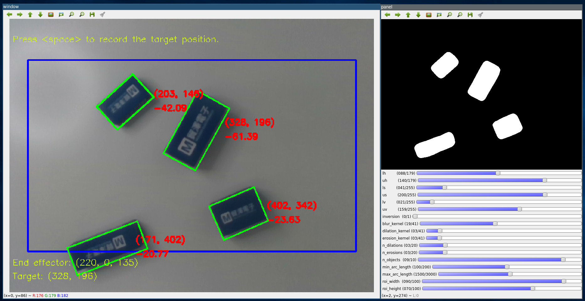
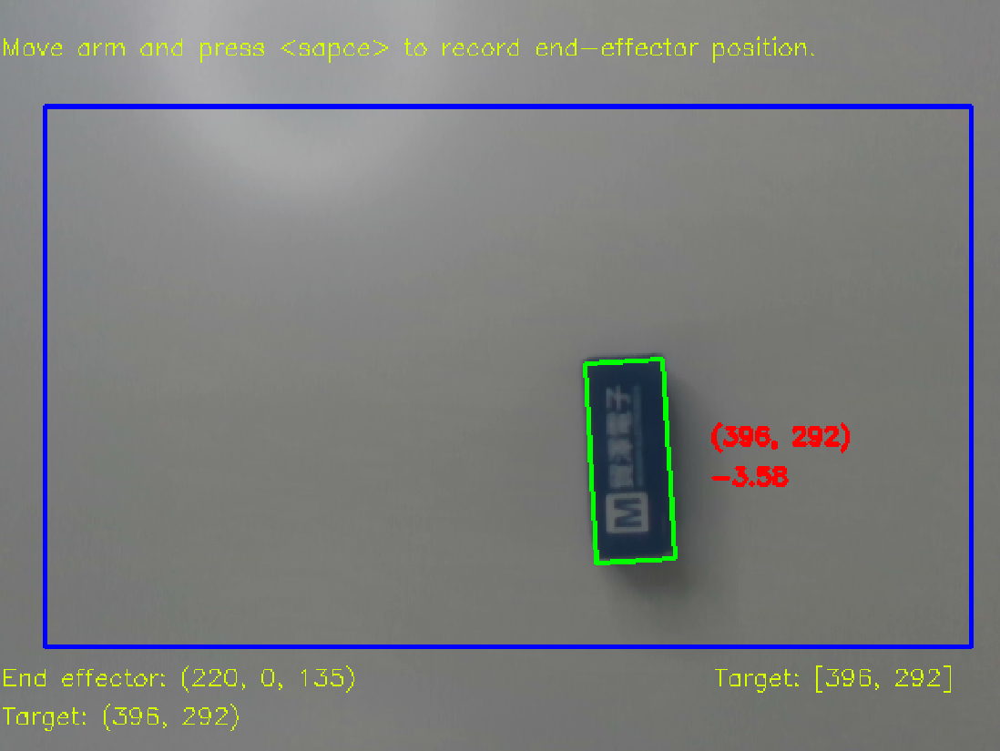

= Calibration of The Sensor And The Robotic Arm
:toc:
:experimental:
:icons: font

== Get started

Given some new targets, if we want to make the robot be capable of detecting the targets.

.targets.jpg
image::./pics/targets.jpg[align="center"]

We can use the helper program https://github.com/jerry73204/hacky-arm/tree/master/utils/calibrate.py[calibrate.py],
to fine tune the parameters.

    ./calibrate.py

In the following, we will elaborate on the usage for different purposes.

== Tune the object detection

The overall detection algorithm is based on OpenCV,
which involves some common processings like HSV color thresholding, blurring, dilation/erosion, ...

=== Step 1. Preparation

Power on the robotic arm and await until it wakes up.
Attach the realsense camera and connect both two to the controller(here we use Nvidia Jetson Nano).

Launch the program with the following command.

    ./calibrate.py

=== Step 2. Reset the robot's coordinate

Every time you awake up the robotic arm, you'd better reset its home coordinate.
Just directly press kbd:[r] to reset it.
Note that it will take about several minutes to finish the process.
After calibrated, press kbd:[h] can make the robotic arm go back to its origin
(sometimes we call this the home coordinate).

[NOTE]
To keep the calibration correct,
always remember to reset the robotic arm(press kbd:[h] to go home)
if the camera's position has been accidentally changed.

=== Step 3. Tune the object detection

The program will display two windows, the left one is for object detection and the right one is for
parameters adjustment.

You may find the default parameters are not suitable in your case.

For example,

image::./pics/detection-failed.png[align="center"]

Now you can try to drag the slider to adjust each parameter.
The following table show the detail of each parameter.

.Parameters
[options="header",cols="^3,10"]
|===
| Name  ^| Expression
| lh,uh | Lower/upper hue.
| ls,us | Lower/upper saturation.
| lv,uv | Lower/upper value.
| inversion | Invert the threshold(switch the roles of black and white) for some targets with light color
| {blur,dilation,erosion}_kernel | Kernel of {median blur,dilation,erosion}. The larger the kernel, the wider the affecting range.
| n_{dilations,erosions} | Number of {dilations,erosions}.
| n_objects | The maximum number of detected objects.
| {min,max}_arc_length | The {min,max} permissible perimeter of detected objects.
| roi_{width,height} | Specify the {width,height} of ROI(region of interest). Only the objects in the blue rectangle would be considered.
|===

[NOTE]
For more details on the HSV color representation, please refer to https://www.wikiwand.com/en/HSL_and_HSV[here].

==== Tips for detecting the objects

Since algorithm uses the color information to detect the objects,
the performance depends on the HSV thresholding. +
For example, if the targets are blue.
From the prior knowledge, we know the hue value of blue is 240 degree.
Note that OpenCV use hue value in a range: 0-179, not the standard 0~359.
So the hue value here(the blue color) should be chosen around 120. +
Secondly, you can adjust the `saturation` and the `value` to attain a better detection. +
Finally, to make the bounding box get close to your targets, adjust the iterations of
dilation and erosion.

Here's a demo after fine-tuned.

Finally, you can press kbd:[s] to save the parameters.
The output file will export to `hacky-arm/utils/output.json`.

Also, if you want to load the parameters next time,
run the following command with an additional arguments like the below.

    ./calibrate.py --config output.json

=== Step 4: Update the parameters into the main program

Modify the `object_detector` in the configuration file `hacky-arm/arm/config.json`.

[source, json, options="nowrap"]
----
        ⋮
"object_detector": {
    "params_file": "PATH_OF_YOUR_FINE_TUNED_PARAMETERS.json",
},
        ⋮
----

Now you can call the program with the new parameters by running the following command inside
the directory `hack-arm/arm`.

    ./target/release/hacky-arm

== Calibrate the arm grabbing

To make the robotic arm can grab the target according to
the detected results, we need to collect some paired data
(target's positions v.s. robotic arm's coordinates) to
train the robot.

=== Step 1: Preparation

Follow the **Step 1** and **Step 2** in **Tune the object detection**.

=== Step 2: Data collection

First, place a single target you want to detect inside the robot's vision.
Now you can press kbd:[Space] to record the current target's position.

image::./pics/collect-data-1.png[align="center"]

Fix the target's position and drag the robotic arm above the target.

image::./pics/grab.png[align="center"]

And then press kbd:[Space] again, the program will record the current coordinate
of the arm as a pair to the previous target's position.
If you want to cancel this pairing, press kbd:[q] can return to the awaiting
collecting target position mode.

Finally, you can find a new data has been collected. For example,
a pair of coordinate of the end effector: `(220, 0, 135)` and the target's position: `(396, 292)`.

=== Step 3: Train a model to learn the grabbing

Repeat **Step 2.** several times to collect enough data.
All the data will be stored into the file `data.csv` automatically.
Or you can specify some file name by running the command with an additional argument like

    ./calibrate.py --data YOUR_DATA.csv

Here's an example.

data.csv
[source, csv, options="nowrap"]
----
301,330,231,40,-28
530,379,214,-45,-28
374,388,211,11,2
234,272,255,68,2
139,361,226,106,4
290,401,207,47,2
275,305,245,51,2
431,338,220,0,135
409,336,220,0,135
408,337,220,0,135
353,169,220,0,135
347,164,220,0,135
408,332,220,0,135
410,338,220,0,135
430,341,220,0,135
----

[NOTE]
Since the relation between the target position and the robotic arm coordinate is
close to an affine transformation, it doesn't require too many data to train the model. +
From our experience, 10~20 data points is enough.

Once you finished the data collection, we can move to the next step _training_.

    ./train.py --data YOUR_DATA.csv

It will train a neural network model(which requires pyTorch installed) to learn the data.
The architecture of the network is very simple, which consists only one layer(a matrix and a bias)
because the relation between the target and the arm coordinate
is actually close to an affine transformation.

And don't worry about the computing load. Since this model is shallow, it's very easy to train even on CPU.

After the training finished, you can see the output like

[source, console, options="nowrap"]
----
            ⋮
Step: 14940, Loss: 4.236
Step: 14945, Loss: 4.236
Step: 14950, Loss: 4.236
Step: 14955, Loss: 4.236
Step: 14960, Loss: 4.236
Step: 14965, Loss: 4.236
Step: 14970, Loss: 4.236
Step: 14975, Loss: 4.236
Step: 14980, Loss: 4.236
Step: 14985, Loss: 4.236
Step: 14990, Loss: 4.236
Step: 14995, Loss: 4.236    <1>
[[-0.00267103 -0.4248405 ]  <2>
 [-0.41760862  0.0051282 ]]
[371.97266 165.54747]       <2>
----
<1> The loss here is MSE(mean square error) calculated in the robotic coordinate.
<2> As mentioned beforehand, the model's parameters consist of a matrix and a bias.

=== Step 4: Update the parameters into the main program

Modify the `controller` in the configuration file `hacky-arm/arm/config.json`.

[source, json, options="nowrap"]
----
        ⋮
"controller": {
    "linear_transform": [                   <1>
        [-0.00267103, -0.4248405],
        [-0.41760862, 0.0051282]
    ],
    "translation": [371.97266 165.54747],   <2>
        ⋮
----
<1> Fill in the matrix term into the variable `linear_transform`.
<2> Fill in the bias term into the variable `translation`.

Now you can call the program with the new parameters by running the following command inside
the directory `hack-arm/arm`.

    ./target/release/hacky-arm

